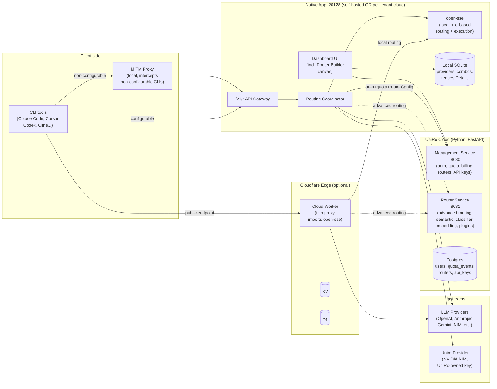

# UniRo Ecosystem Architecture Plan — v2

> Supersedes the v1 plan at `~/.cursor/plans/uniro_ecosystem_architecture_plan_0f2c0018.plan.md`.
> All decisions in this document reflect the answers given in the v1→v2 review pass.
>
> **v2.1 — Supabase addendum:** Management Service is **replaced by Supabase** (project `Uniro` — `hoswohlkkvhplavvvvyk`). Auth = `supabase-auth`. DB = Supabase Postgres with Row-Level Security scoped to `auth.uid()`. Hot path (`session-resolve`) and usage ingestion run as **Supabase Edge Functions** (Deno), invoked with the service-role key by the Native App gateway. No bespoke FastAPI Management Service is built. The Python **Router Service** is unchanged — still a separate FastAPI service for advanced routing because it needs ML model artifacts.

---

## 0. Decisions locked in v2

| # | Question | Decision |
|---|----------|----------|
| 1 | Self-hosted vs. SaaS | **Hybrid.** Native App can run self-hosted (offline) OR connect to central Management for quota/billing/cloud-routing. Quota tiers apply only when connected. |
| 2 | Routing engine duplication | **Two engines, user-selectable per router.** `open-sse/` stays as the local rule-based engine. Python Router Service hosts advanced techniques (semantic, classifier, embedding, custom). User picks engine per router. |
| 3 | Existing `UniRo/backend/` Python project | **Deprecated.** Ignored in v2. The new Python services are greenfield. |
| 4 | Per-request fan-out latency | **Apply improvements:** single combined `/auth+quota+router` endpoint, client-side router cache with version invalidation, async/batched usage events. |
| 5 | Service-to-service auth | **Short-lived HMAC service tokens** minted by Management, validated by Router Service. No shared static secrets. |
| 6 | Risky refactor of `/v1/chat/completions` | **Behind a feature flag.** Old path stays the default; new coordinator path opt-in per router until validated. |
| 7 | Router storage format | **Canvas = source of truth in UI, YAML = wire/storage format.** `yaml.js` already round-trips. Server-side YAML validation required. |
| 8 | Quota table modeling | **Event ledger** (`quota_events`) + materialized per-period aggregates. Supports refunds, retroactive grants, multi-resource (tokens/requests/images). |
| 9 | API key scopes | First-class scoping: router-id allowlist, model-family allowlist, max-tokens-per-request, IP allow-list, expiry. |
| 10 | Phase ordering | **Refactor `/v1/chat/completions` early.** Pre-production, low risk. |
| 11 | Cloudflare Worker (`cloud/`) | **Keep as thin edge proxy.** Continues to import `open-sse` for local routing; optionally HTTP-calls Router Service for advanced routers. |
| 12 | MITM (`src/mitm/`) | **Unchanged.** Local-only intercept for non-configurable CLI tools. Forwards to Native App which then uses the new coordinator. |

---

## 1. What UniRo is, in one paragraph

UniRo is an OpenAI-compatible LLM router. A user authenticates once and gets a single endpoint; UniRo handles auth, format translation, token refresh, multi-account fallback, prompt compression (RTK), and — new in this plan — **user-defined semantic routing** with a 5-layer pipeline (Signal → Projection → Decision → Model → Plugin). Users can bring their own provider credentials (self-hosted keys, OAuth subscriptions, third-party API keys, free public providers) **or** use the built-in **Uniro provider** (NVIDIA NIM-backed) when signed in, which is rate-limited per their subscription tier.

---

## 2. System topology



Solid arrows are always-present. Dashed arrows are taken only when (a) the request's API key has a router that the user marked as "advanced" *and* (b) Router Service is reachable; otherwise fall back to local routing.

---

## 3. Three services, in detail

### 3.1 Native App (Next.js — this repository)

**Role:** Public face. API gateway, dashboard, router-builder canvas, local SQLite, MITM control panel. May run fully self-hosted; quota/billing/cloud-routing only activate when paired with Management.

**Per-request flow at `/v1/chat/completions`:**

1. Read `Authorization: Bearer <api-key>`.
2. **Self-hosted mode** (no Management configured): validate against local API keys, run `open-sse` directly. Done.
3. **Connected mode:**
   1. Look up cached `{user, quota, router_config}` for this API key in-memory. On miss/expiry, call Management's `POST /v1/session/resolve` (combined auth+quota+router lookup; see §4.1).
   2. Apply RTK compression (existing `open-sse/rtk/`).
   3. If `router_config.engine == "local"`: hand to `open-sse` chat handler — unchanged from today.
   4. If `router_config.engine == "remote"`: `POST` to Router Service `/v1/route`. Receive `{model, plugins[], modified_request}`. On Router Service error → fall back to local engine using `router_config.fallback_model`.
   5. Resolve the chosen model to a provider connection (user-owned, free, or Uniro provider) using existing provider/combo logic.
   6. Execute via `open-sse/executors/*`. Stream response.
   7. After stream end, queue a `quota_event` for Management (async, batched per ~5s or per ~50 events).

**Self-hosted toggle.** A single setting `connectedMode: boolean`. When `false`, the gateway never calls Management or Router Service, and all routers default to the local engine. The Dashboard's quota/subscription pages hide themselves.

**Local cache for router configs.** `router_config` rows fetched from Management get a `version` integer. The session-resolve response returns the current version; on mismatch with the cached one, refetch the full config. TTL fallback: 5 min.

### 3.2 Management Service (Python, FastAPI) — new

**Role:** User identity, billing, quota, API keys, router CRUD. Multi-tenant. Owns Postgres.

**Postgres schema (initial):**

```sql
-- Identity
users          (id, email, password_hash, status, created_at, updated_at, last_login)
sessions       (id, user_id, token_hash, user_agent, ip, expires_at, created_at)
subscriptions  (user_id, plan, status, period_start, period_end, auto_renew, stripe_sub_id)

-- API keys (per-user, scoped)
api_keys       (id, user_id, key_prefix, key_hash, name, created_at, last_used_at, expires_at, revoked_at)
api_key_scopes (api_key_id, scope_type, scope_value)
                 -- scope_type ∈ {router_id, model_family, max_tokens_per_request, ip_cidr}

-- Routers (user-defined)
routers        (id, user_id, name, description, engine, fallback_model,
                config_yaml, version, created_at, updated_at, deleted_at)
                 -- engine ∈ {'local', 'remote'}; version is a monotonic int

-- Quota (event-sourced ledger + materialized aggregates)
quota_events   (id, user_id, resource, delta, balance_after, source, ref_id, occurred_at)
                 -- resource ∈ {tokens_in, tokens_out, requests, images, audio_seconds, uniro_provider_tokens}
                 -- source   ∈ {usage, grant, refund, monthly_reset, manual}
quota_balance  (user_id, resource, period_start, period_end, balance)
                 -- materialized rollup, rebuildable from quota_events

-- Plan definitions (config, not user data)
plans          (code, name, monthly_grants_json, rate_limits_json, features_json)
```

**Endpoints:**

```
# Auth
POST   /v1/auth/register
POST   /v1/auth/login
POST   /v1/auth/logout
POST   /v1/auth/refresh

# Self
GET    /v1/users/me
PATCH  /v1/users/me

# Combined hot-path endpoint used by the Native App gateway
POST   /v1/session/resolve
  body  { api_key }
  resp  { user_id, plan, quota_summary,
          router: { id, version, engine, fallback_model, config_yaml },
          mint:   { service_token, expires_in }   # for Router Service calls
        }
  caching headers: ETag = sha256(router_config) || quota_period

# Quota
GET    /v1/quota
POST   /v1/quota/events      # batched async report from gateways (idempotent on ref_id)
GET    /v1/quota/events?since=

# Subscriptions
GET    /v1/subscription
POST   /v1/subscription/upgrade
POST   /v1/subscription/cancel

# API keys
POST   /v1/api-keys
GET    /v1/api-keys
DELETE /v1/api-keys/:id
PATCH  /v1/api-keys/:id/scopes

# Routers
GET    /v1/routers
POST   /v1/routers
GET    /v1/routers/:id        # returns config_yaml + version
PUT    /v1/routers/:id        # bumps version
DELETE /v1/routers/:id
POST   /v1/routers/:id/validate
POST   /v1/routers/:id/dry-run  body={sample_request} resp={trace}
```

**Plan tiers (initial — adjust later):**

| Plan | Monthly request quota | Uniro-provider token quota | Rate limit | Custom routers | Notes |
|---|---|---|---|---|---|
| Free | 5,000 | 1,000,000 | 60/min | 1 | Uniro provider on NIM |
| Starter | 100,000 | 25,000,000 | 300/min | 5 | |
| Pro | 1,000,000 | 250,000,000 | 1,000/min | unlimited | |

Quota is **per-resource** (the table accommodates more than tokens) and counted *only* against Uniro-managed inference when the user uses the Uniro provider or the Router Service. User-owned provider keys do **not** count against token quota — only against the `requests` resource for rate-limiting.

### 3.3 Router Service (Python, FastAPI) — new

**Role:** Stateless advanced routing. Receives a request + a router YAML, returns the decision. No provider calls. Owns its own model artifacts (sentence-transformers, classifier centroids, jailbreak/PII detectors) loaded once at boot.

**Endpoint:**

```
POST /v1/route
  headers: Authorization: Bearer <service_token>   # HMAC-signed, ~5min TTL
  body:    { request: OpenAIRequest, router: { config_yaml, version, engine: "remote" } }
  resp:    { model: "qwen-math",
             plugins_applied: ["semantic-cache", "system-prompt"],
             modified_request: {...},                # request after pre-processing plugins
             trace: { signals: {...}, projections: {...}, route: "math_routing" } }
```

**5-layer pipeline (mirrors `semantic-router-overview.md`):**

1. **Signal extraction.** Hardcoded extractor families (heuristic + learned). YAML names which to run; missing ones are skipped.
2. **Projection coordination.** `partitions`, `weighted_sum`, `threshold_bands`.
3. **Decision engine.** Evaluates `when` clauses with AND/OR/NOT.
4. **Model selection.** Returns the model name; provider resolution is the Native App's job.
5. **Plugin chain.** Pre-processing plugins (semantic-cache, system-prompt injection, jailbreak filter, hallucination check, etc.). Post-processing plugins run on the Native App side after execution.

**Stateless guarantee.** The service holds no per-user, per-request, or per-router state in memory. ML model artifacts (embeddings, classifiers) are loaded at boot from disk. Semantic cache, if enabled, uses Redis with a deployment-wide key prefix.

---

## 4. Cross-cutting concerns

### 4.1 The hot-path: `/v1/session/resolve`

Collapses three v1-plan round-trips into one. Returns everything the gateway needs to handle a request: the user, their quota status, the resolved router config, and a freshly-minted service token for Router Service calls. Idempotent and cacheable on the gateway side keyed by `api_key`. ETag includes `router_version` and `quota_period_start` so a 304 short-circuit is the common case.

### 4.2 Service-to-service auth

Management owns a signing key `MGMT_SERVICE_SIGNING_KEY`. The service token returned in `/v1/session/resolve` is an HMAC-SHA256 of `{user_id, router_id, exp}` with that key. Router Service holds the same key in env and verifies on every call. TTL ~5 minutes. No rotation infrastructure needed in v2; rotate by deploying a new key alongside the old one and accepting both for the rotation window.

### 4.3 Quota event reporting

Native App accumulates `quota_events` in an in-memory queue, flushes every 5s or 50 events (whichever first). Each event has a `ref_id` (usually the request ID), making `POST /v1/quota/events` idempotent. On 5xx from Management, the queue retries with exponential backoff up to 10 minutes; after that, the event is logged and dropped (better to under-bill than to block the user). On Native App shutdown, the queue is drained synchronously.

### 4.4 Degraded modes

| Failure | Native App behavior |
|---|---|
| Management down | Use cached `/v1/session/resolve` response. On cache miss, reject with 503 (after 2s timeout). |
| Router Service down | Fall back to `router_config.fallback_model` via `open-sse`. Log a degraded-routing event. |
| Provider down | Existing `open-sse/services/accountFallback.js` chain. |
| Self-hosted mode (Management absent by design) | Skip Management entirely; never call Router Service. |

### 4.5 Router storage and validation

- Canvas (React Flow) is the source of truth in the UI.
- `src/app/(dashboard)/dashboard/router-builder/yaml.js` round-trips canvas ↔ YAML.
- Save = serialize canvas → YAML → `PUT /v1/routers/:id` (server validates with the same schema the Router Service uses to execute).
- Load = `GET /v1/routers/:id` → YAML → canvas (existing `yaml.js`).
- Validation runs in the browser for UX (instant errors), then again on the server for trust.

### 4.6 API key scopes

A request fails fast at the gateway if any scope is violated:

- `router_id` allowlist — key may only invoke the listed routers (empty = all).
- `model_family` allowlist — key may only resolve to listed model families.
- `max_tokens_per_request` — server-side enforced cap.
- `ip_cidr` — request must originate from a listed CIDR.
- `expires_at` — implicit scope.

### 4.7 Cloudflare Worker (`cloud/`) in v2

- Continues to import `open-sse` and use D1/KV exactly as today.
- For advanced routers, calls Router Service via HTTPS using a service token issued by Management (the Worker pairs to Management at deploy time and stores a long-lived "worker key" in `wrangler secret`).
- For requests against the Uniro provider, the Worker calls Management's `/v1/session/resolve` like the Native App does.
- No new code needed in v2 phase 1–3; Worker integration is phase 5+.

### 4.8 MITM (`src/mitm/`) in v2

- Unchanged. Still a separate Node process under the Native App's control.
- It forwards intercepted requests to `http://localhost:20128/v1/*`, so all of the new coordinator/cache/router logic applies transparently.
- The only thing to add: when the dashboard configures `connectedMode: true`, the MITM control panel should warn that quota will be counted (currently it doesn't say).

---

## 5. Directory layout (post-change)

```
UniRo/                                  # repo root
├── uniro_frontend_v2/                  # Native App (this repo)
│   ├── src/
│   │   ├── app/
│   │   │   ├── (auth)/                 # login, register pages (cloud mode only)
│   │   │   │   ├── login/page.js
│   │   │   │   └── register/page.js
│   │   │   ├── (dashboard)/
│   │   │   │   ├── dashboard/
│   │   │   │   │   ├── home/           # new: user overview, quota chart
│   │   │   │   │   ├── settings/      # new: API keys, subscription
│   │   │   │   │   └── router-builder/ # unchanged canvas; backed by Management
│   │   │   │   └── ...
│   │   │   └── api/
│   │   │       └── v1/
│   │   │           └── chat/route.js   # refactored to use Coordinator
│   │   ├── lib/
│   │   │   ├── auth/
│   │   │   │   ├── session.js          # new
│   │   │   │   ├── managementClient.js # new — HTTP client for Management
│   │   │   │   └── middleware.js       # new
│   │   │   ├── routing/
│   │   │   │   ├── coordinator.js      # new — orchestrates Mgmt + Router + open-sse
│   │   │   │   ├── routerCache.js      # new — local cache with version invalidation
│   │   │   │   └── usageQueue.js       # new — batched quota_events flusher
│   │   │   └── config/
│   │   │       └── mode.js             # new — connectedMode toggle
│   │   └── mitm/                       # unchanged
│   ├── open-sse/                       # unchanged — local rule-based engine
│   └── cloud/                          # Worker; gains optional Router Service callout
│
└── uniro_backend/                      # new sibling repo for the Python services
    ├── management/
    │   ├── pyproject.toml
    │   ├── uniro_management/
    │   │   ├── main.py
    │   │   ├── auth/
    │   │   ├── users/
    │   │   ├── api_keys/
    │   │   ├── routers/
    │   │   ├── quota/
    │   │   ├── subscription/
    │   │   └── db/
    │   └── migrations/                 # alembic
    │
    └── router/
        ├── pyproject.toml
        ├── uniro_router/
        │   ├── main.py
        │   ├── engine.py
        │   ├── signals/
        │   ├── projections/
        │   ├── decisions/
        │   └── plugins/
        └── models/                     # downloaded ML artifacts (gitignored)
```

The two Python services live in a separate `uniro_backend/` repo, not under `uniro_frontend_v2/`. Keeping languages separated by repo simplifies CI, ops, and ownership.

---

## 6. Implementation phases

### Phase 1 — Management Service skeleton (week 1–2)
- FastAPI scaffold, Postgres, alembic.
- `users`, `sessions`, `api_keys`, `routers` tables.
- `/v1/auth/*`, `/v1/users/me`, `/v1/api-keys`, `/v1/routers` (CRUD with YAML pass-through validation).
- `/v1/session/resolve` returning auth + router; quota stubbed.

### Phase 2 — Native App coordinator (week 2–3)
- `src/lib/routing/coordinator.js`, `routerCache.js`, `usageQueue.js`.
- `src/lib/auth/managementClient.js` with retry + cache headers.
- `connectedMode` toggle on dashboard.
- Refactor `/v1/chat/completions` to go through Coordinator. **Behind feature flag** even though pre-prod.

### Phase 3 — Quota and billing (week 3–4)
- `quota_events`, `quota_balance` tables + materialization job.
- `POST /v1/quota/events` idempotent ingestion.
- Native App `usageQueue` flushing on real traffic.
- Dashboard quota chart at `/dashboard/home`.

### Phase 4 — Router Service v1 (week 4–6)
- FastAPI scaffold, ML model bootstrapping.
- Signal extractors (start with: keyword, language, structure, complexity, embedding, jailbreak — the high-ROI ones).
- Projection engine (partitions, weighted_sum, threshold_bands).
- Decision engine.
- Pre-processing plugins (semantic-cache stub, system-prompt, jailbreak-block).
- `/v1/route` with HMAC service-token auth.
- Native App: enable `engine: "remote"` path; per-router opt-in in the Router Builder.

### Phase 5 — Uniro provider + free tier (week 6–7)
- Provision NVIDIA NIM key in Management config.
- Add `UniroProvider` to `open-sse/executors/` that talks to NIM with the server-side key.
- Wire `uniro_provider_tokens` quota resource through the meter.
- Dashboard: free-tier sign-up flow grants 1M Uniro-provider tokens.

### Phase 6 — Cloud Worker integration (week 7+)
- Worker reads `MANAGEMENT_BASE_URL` + `WORKER_KEY` from `wrangler secret`.
- Mirrors Native App coordinator: session-resolve, optional Router Service call, usage events.
- Smoke test pair flow: deploy Worker → paste URL → enable cloud → request from Claude Code.

### Phase 7 — Polish (rolling)
- Router Builder: `dry-run` button that posts a sample request to `/v1/routers/:id/dry-run` and shows the trace overlay on canvas.
- Subscription management UI + Stripe.
- Admin UI in Management (user search, quota grants, revoke keys).
- Drop the feature flag in `/v1/chat/completions` once real traffic is validated.

---

## 7. Files this plan touches

### New in `uniro_frontend_v2/`

| File | Purpose |
|---|---|
| `src/lib/config/mode.js` | `connectedMode` toggle + accessors |
| `src/lib/auth/session.js` | Decode/store Management JWT in dashboard |
| `src/lib/auth/managementClient.js` | HTTP client (retries, ETag, breaker) |
| `src/lib/auth/middleware.js` | Dashboard route guard |
| `src/lib/routing/coordinator.js` | Per-request orchestration |
| `src/lib/routing/routerCache.js` | In-memory router config cache |
| `src/lib/routing/usageQueue.js` | Batched quota_events flusher |
| `src/app/(auth)/login/page.js` | New |
| `src/app/(auth)/register/page.js` | New |
| `src/app/(dashboard)/dashboard/home/page.js` | New: quota + usage chart |
| `src/app/(dashboard)/dashboard/settings/page.js` | New: API keys, subscription |

### Modified in `uniro_frontend_v2/`

| File | Change |
|---|---|
| `src/app/api/v1/chat/route.js` (and siblings) | Route via Coordinator when feature flag on |
| `src/app/(dashboard)/dashboard/router-builder/page.js` | Save/load against Management; add `engine: local | remote` selector and `dry-run` panel |
| `src/app/(dashboard)/dashboard/router-builder/yaml.js` | Add `engine`, `fallback_model`, `version` fields to schema |
| `src/app/layout.js` | Auth provider when `connectedMode` |
| `cloud/src/index.js` | Optional Router Service callout + Management session-resolve |

### Unchanged

- All of `open-sse/` (becomes the "local" engine; same code paths as today).
- All of `src/mitm/`.
- Local SQLite repos (`src/lib/db/`); they continue to own provider connections, combos, request details. Management owns *user-level* state only.

---

## 8. Open follow-ups (not blockers for v2 build)

- Post-processing plugins on the Native App side (hallucination check, response_jailbreak) — currently not in the Router Service contract because they run *after* provider execution. Decide whether they're a separate Native-App-side plugin chain or a second Router Service call.
- Streaming + Router Service: the `/v1/route` call is non-streaming and runs before provider dispatch, so this is fine, but document it.
- Multi-region Management. Out of scope for v2.
- BYOK Uniro-provider replacement (user supplies their own NIM key) — design later; same `UniroProvider` executor can accept user-scoped keys.
